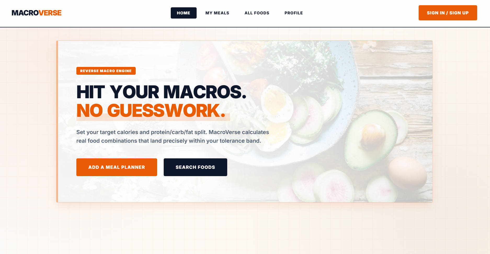
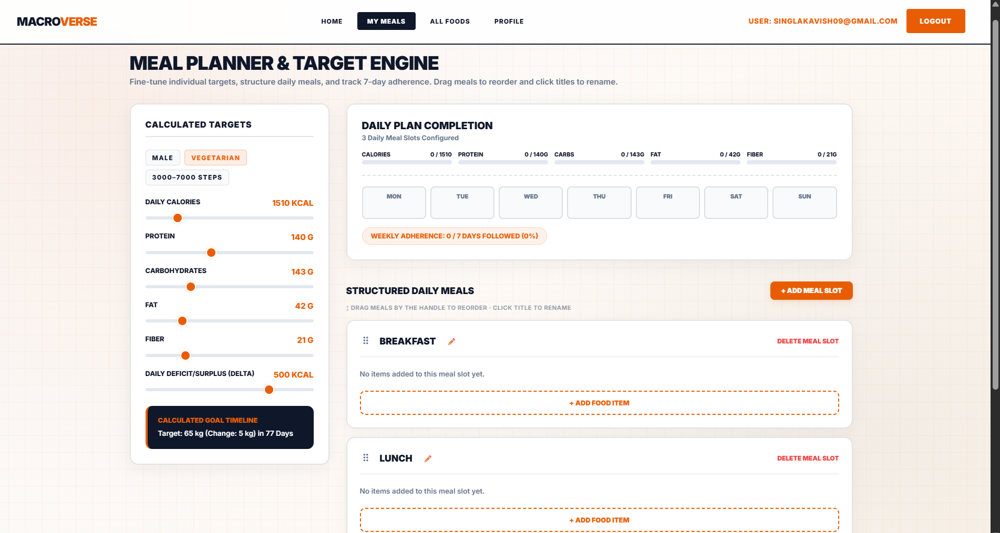
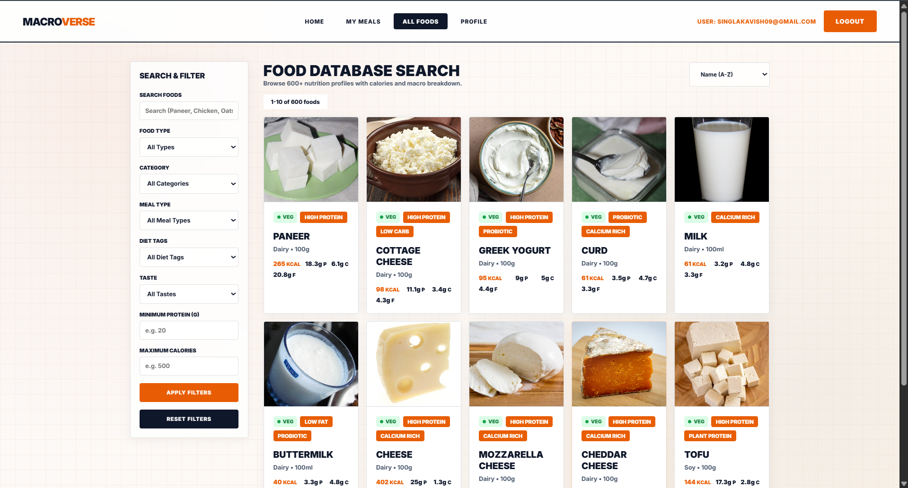

# 🥗 MacroVerse

### Hit Your Macros. No Guesswork.

MacroVerse is a smart nutrition and meal planning web application designed to help users achieve their fitness goals by calculating personalized calorie and macronutrient targets and creating structured meal plans.

The platform combines nutrition tracking, food database exploration, and personalized meal planning to make healthy eating easier and more data-driven.

---

## 📌 About The Project

Maintaining a proper diet requires understanding calories, protein, carbohydrates, fats, and personal fitness goals. Many people struggle with manually calculating nutritional requirements and planning meals accordingly.

**MacroVerse solves this problem by providing:**

* Personalized calorie and macro calculations
* Structured daily meal planning
* Extensive food database search
* Nutrition-based filtering
* User profile customization
* Goal tracking for fitness journeys

The application focuses on making nutrition planning simple, accurate, and accessible.

---

# ✨ Features

## 🧮 Personalized Macro Calculation

* Calculates daily calorie requirements
* Determines protein, carbohydrate, fat, and fiber targets
* Considers:

  * Age
  * Gender
  * Height
  * Weight
  * Activity level
  * Exercise type
  * Fitness goals

---

## 🍱 Smart Meal Planner

Users can:

* Create daily meal schedules
* Add meals according to their targets
* Organize breakfast, lunch, dinner, and snacks
* Track daily macro completion
* Monitor weekly adherence

---

## 🍎 Food Database

A searchable nutrition database containing:

* 600+ food items
* Calories information
* Protein values
* Carbohydrate values
* Fat content
* Dietary tags

Users can filter foods based on:

* Food type
* Category
* Meal type
* Diet preferences
* Protein range
* Calorie range

---

## 👤 User Profile Management

Users can manage:

* Personal information
* Fitness goals
* Weight targets
* Exercise preferences
* Dietary preferences
* Meal frequency

---

# 📸 Screenshots

## 🏠 Landing Page



---

## 🍽️ Meal Planner Dashboard



---

## 🔍 Food Database Search



---

# 🛠️ Technologies Used

| Technology    | Purpose                                |
| ------------- | -------------------------------------- |
| HTML5         | Website structure                      |
| CSS3          | Styling, layouts and animations        |
| JavaScript    | Dynamic functionality and interactions |
| Local Storage | Client-side data management            |

---

# 🎨 Design Highlights

MacroVerse follows a modern fitness-inspired UI design with:

* Clean dashboard layout
* Responsive components
* Minimal color palette
* Orange and navy branding
* Interactive cards
* Modern typography
* Grid-based background design


# ⚙️ Installation & Setup

Follow these steps to run MacroVerse locally.

### 1. Clone the repository

```bash
git clone https://github.com/yourusername/macroverse.git
```

### 2. Navigate into the project folder

```bash
cd macroverse
```

### 3. Open the project

Open:

```
index.html
```

in your browser.

No additional dependencies are required.

---

# 🚀 Usage

1. Create your profile
2. Enter your body information and fitness goals
3. Get personalized calorie and macro targets
4. Explore food items
5. Add meals to your daily planner
6. Track your nutrition progress

---

# 🔮 Future Enhancements

Future improvements planned:

* Backend integration
* User authentication system
* Cloud database storage
* AI-based meal recommendations
* Barcode food scanner
* Progress graphs and analytics
* Mobile application version

---

# 🎯 Project Objectives

The main objectives of MacroVerse are:

* To simplify nutrition planning
* To provide accurate macro calculations
* To encourage healthier eating habits
* To reduce manual diet calculations
* To create a personalized fitness experience

---

# 👨‍💻 Contributors

Developed by:

* Kavish Singla
* Arshdeep Singh
* Madhav Sharma
---

# ⭐ Support

If you like this project, consider giving it a ⭐ on GitHub.
